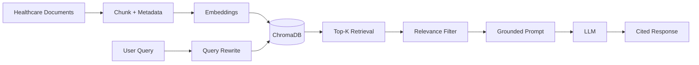

# Healthcare Document Assistant — Advanced RAG

A portfolio-ready GenAI project demonstrating an **Advanced Retrieval-Augmented Generation (RAG)** architecture for a synthetic healthcare knowledge base.

> **Important:** This repository uses synthetic documents only. It is an educational portfolio project and must not be used for clinical diagnosis, treatment decisions, or real patient data.

## What this project demonstrates

- Document ingestion and section-aware chunking
- Embeddings with Sentence Transformers
- Vector search using ChromaDB
- Query rewriting / terminology expansion
- Metadata-aware retrieval
- Top-K retrieval
- Relevance threshold filtering
- Grounded LLM generation
- Source citations
- Safe fallback when an LLM is not configured
- Unit tests and GitHub Actions CI

## Architecture



## Project structure

```text
healthcare-rag-document-assistant/
├── data/documents/
│   ├── patient-care.md
│   ├── insurance.md
│   └── hospital-policies.md
├── src/
│   ├── __init__.py
│   ├── rag.py
│   └── main.py
├── tests/test_rag.py
├── docs/
│   ├── architecture.md
│   └── interview_questions.md
├── .github/workflows/tests.yml
├── .env.example
├── .gitignore
├── requirements.txt
└── README.md
```

## How the RAG flow works

### 1. Ingestion
Synthetic healthcare documents are loaded from `data/documents`.

### 2. Chunking
The documents are split using Markdown section boundaries so each chunk represents a meaningful knowledge unit.

### 3. Metadata
Each chunk stores metadata such as source document and topic.

### 4. Embedding
Chunks and queries are converted into vectors using `all-MiniLM-L6-v2` by default.

### 5. Retrieval
The rewritten query is embedded and used to retrieve the most relevant chunks from ChromaDB.

### 6. Metadata filtering
The retrieval layer supports topic filtering, demonstrating how enterprise RAG can narrow results using structured metadata.

### 7. Relevance filtering
Retrieved results are filtered using a configurable relevance threshold before being passed to the LLM.

### 8. Grounded generation
The LLM receives only the retrieved evidence and is instructed not to invent medical or organizational information.

### 9. Citations
Answers reference retrieved evidence using `[1]`, `[2]`, etc.

## Run locally

```bash
python -m venv .venv
# Windows
.venv\Scripts\activate
# Linux/macOS
# source .venv/bin/activate

pip install -r requirements.txt
copy .env.example .env
python src/main.py
```

If `OPENAI_API_KEY` is not configured, the application still demonstrates the retrieval pipeline and prints the retrieved evidence instead of generating an LLM response.

## Example questions

- What is the typical claim submission process?
- What does preauthorization mean for a health insurance service?
- How should patients approach medication changes?
- What should be reviewed during discharge?
- What are the privacy expectations for patient information?

## Basic RAG vs this project

| Capability | Basic RAG | This project |
|---|---:|---:|
| Embeddings | Yes | Yes |
| Vector search | Yes | Yes |
| Top-K retrieval | Yes | Yes |
| Query rewriting | Usually no | Yes |
| Metadata | Basic/optional | Yes |
| Metadata filtering | Usually no | Yes |
| Relevance threshold | Usually no | Yes |
| Grounded generation | Yes | Yes |
| Citations | Optional | Yes |

## Production Azure architecture

For an enterprise implementation, map the components as follows:

- **Azure Blob Storage / ADLS Gen2** — document storage
- **Azure AI Search** — hybrid keyword + vector retrieval and metadata filters
- **Azure OpenAI** — embeddings and LLM generation
- **Azure Key Vault** — secrets and configuration
- **Managed Identity / Entra ID** — authentication and authorization
- **Azure Container Apps / App Service** — application hosting
- **Application Insights / Azure Monitor** — observability

Healthcare workloads require appropriate security, privacy, access control, audit, retention, encryption, and organization-specific regulatory/compliance controls. Do not put real PHI into this demo repository.

## Interview explanation

> "I built an advanced RAG healthcare document assistant. Instead of directly embedding the user's raw question, I first normalize and expand common healthcare/business terminology. Documents are section-aware chunks with metadata. ChromaDB performs vector retrieval, followed by metadata filtering and a relevance threshold. Only sufficiently relevant evidence is sent to the LLM. The prompt explicitly requires grounded answers and citations, with a safe fallback when evidence is insufficient. In Azure, I would replace the local vector store with Azure AI Search and use Azure OpenAI, managed identity, Key Vault, monitoring, and appropriate healthcare security controls."

## Future enhancements

- Hybrid BM25 + vector search
- Cross-encoder reranking
- LLM-based query rewriting
- Parent-child document retrieval
- Reciprocal Rank Fusion
- Multi-query retrieval
- Automated RAG evaluation
- LangChain/LlamaIndex orchestration
- Azure AI Search implementation
- Document ingestion for PDF/DOCX
- Role-based document access
- Conversation memory

## License

Educational portfolio project using synthetic data.
