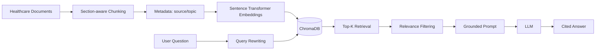

# Architecture

## Advanced RAG patterns demonstrated

1. Metadata-aware chunking.
2. Deterministic query rewriting/expansion.
3. Metadata filtering.
4. Top-K retrieval.
5. Relevance threshold filtering.
6. Grounded generation with citations.
7. Safe fallback when the LLM is not configured.

## Azure production mapping

| Portfolio component | Azure production equivalent |
|---|---|
| Local Markdown | Azure Blob Storage / ADLS Gen2 |
| Sentence Transformers | Azure OpenAI embeddings |
| ChromaDB | Azure AI Search vector/hybrid index |
| OpenAI-compatible LLM | Azure OpenAI |
| `.env` | Azure Key Vault / managed identity |
| Python app | Azure Container Apps / App Service |

For a production healthcare solution, add identity, authorization, audit logging, encryption, PHI controls, retention policies, evaluation, human review, and organization-specific compliance requirements.
